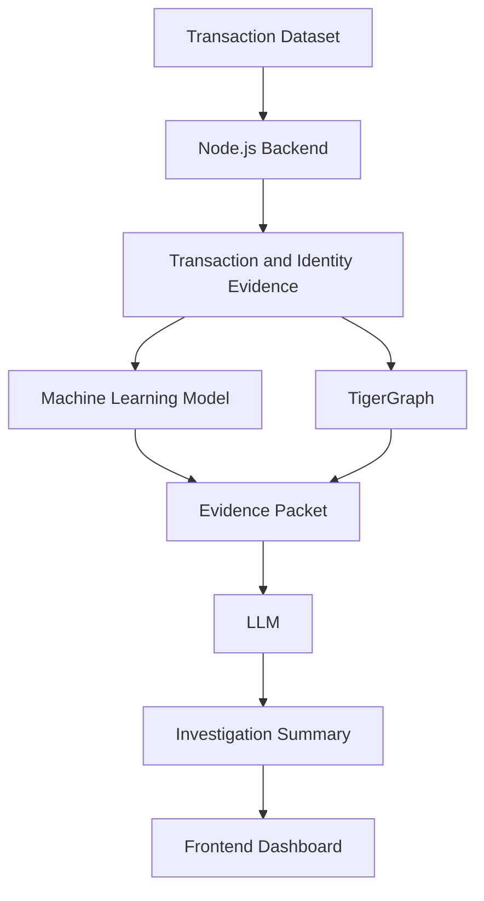

# 🔍 Fraud Investigation Copilot

An AI-assisted fraud investigation system that combines **machine learning, transaction evidence, graph relationships, and LLM-generated explanations** to help investigators understand suspicious financial transactions.

## 🚀 Overview

The **Fraud Investigation Copilot** analyzes transaction data, identifies suspicious patterns, and provides supporting evidence for investigation.

The system combines:

* Machine Learning for fraud prediction
* Transaction-level evidence extraction
* Graph-based relationship analysis
* LLM-generated investigation summaries
* A user-friendly dashboard for reviewing results

## ✨ Features

* Fraud prediction using an ML model
* Transaction and identity data analysis
* Evidence extraction from transaction records
* Detection of related transactions through shared attributes
* Graph-based investigation using TigerGraph
* Evidence-grounded AI-generated summaries
* Modular backend architecture
* API-based communication between system components

## 📊 Dataset

This project uses the **IEEE-CIS Fraud Detection Dataset**.

The dataset contains transaction-related information and identity-related information that can be connected using `TransactionID`.

The project data is stored in **Parquet format** for efficient data handling.

Important information includes:

* Transaction details
* Transaction amount
* Product information
* Card-related attributes
* Address information
* Email-domain information
* Device and identity attributes
* Fraud labels for model training

> Some IEEE-CIS features are anonymized and should not be interpreted without proper documentation.

## 🏗️ System Architecture



## 🔄 Workflow

1. The investigator enters a `TransactionID`.
2. The backend retrieves the related transaction data.
3. Transaction and identity information is combined.
4. The ML model predicts whether the transaction is suspicious.
5. The evidence engine extracts relevant facts.
6. TigerGraph identifies connected transactions and relationships.
7. The collected information is combined into an evidence packet.
8. The LLM generates a clear investigation summary.
9. The frontend displays the prediction, evidence, relationships, and summary.

## 🛠️ Technology Stack

| Component        | Technology                         |
| ---------------- | ---------------------------------- |
| Backend          | Node.js, Express.js                |
| Machine Learning | Python, XGBoost                    |
| Dataset          | IEEE-CIS Fraud Detection           |
| Data Format      | Parquet                            |
| Graph Database   | TigerGraph                         |
| AI Summarization | Gemini LLM                         |
| Frontend         | React, Vite                        |
| API Testing      | Postman / Swagger-compatible tools |

## 📁 Project Structure

```text
Fraud-Investigation-Copilot/
├── data/
│   └── fraud_dataset.parquet
├── backend/
│   ├── server.js
│   ├── config.js
│   ├── routes/
│   ├── services/
│   └── integrations/
├── frontend/
├── model/
└── README.md
```

## 🔌 Main API Endpoints

| Method | Endpoint                           | Description                           |
| ------ | ---------------------------------- | ------------------------------------- |
| GET    | `/api/health`                      | Checks backend health                 |
| GET    | `/api/dataset/status`              | Checks dataset availability           |
| GET    | `/api/transactions`                | Retrieves transaction records         |
| GET    | `/api/transactions/:transactionId` | Retrieves a specific transaction      |
| POST   | `/api/evidence`                    | Generates transaction evidence        |
| POST   | `/api/analyze`                     | Performs complete fraud investigation |

## ⚙️ Installation

### 1. Clone the repository

```bash
git clone https://github.com/krishsharma1159-1159/Fraud-Inestigation-Copilot.git
cd Fraud-Inestigation-Copilot
```

### 2. Install backend dependencies

```bash
npm install
```

### 3. Configure environment variables

Create a `.env` file in the backend directory:

```env
PORT=5000
ML_SERVICE_URL=http://localhost:8000
TIGERGRAPH_URL=
TIGERGRAPH_TOKEN=
GEMINI_API_KEY=
GEMINI_MODEL=gemini-2.5-flash
```

### 4. Start the backend

```bash
npm run dev
```

The backend will run on:

```text
http://localhost:5000
```

## 🧠 Design Principle

The system separates different responsibilities:

```text
ML Model              → Fraud prediction
Backend               → Data processing and evidence extraction
TigerGraph            → Relationship analysis
LLM                   → Investigation summary
Frontend               → Result visualization
```

The LLM does not independently decide whether a transaction is fraudulent. It generates a summary using the evidence and prediction provided by the system.

## 🔐 Responsible AI

* The system uses evidence-based investigation.
* Missing identity information is not automatically treated as fraud.
* The LLM is instructed not to invent transactions, relationships, or facts.
* Model predictions should support investigators rather than replace human judgment.
* Sensitive financial data should be handled securely.

## 🚧 Current Status

The project is being developed as a modular fraud investigation platform. The backend is designed to connect the dataset, ML service, graph database, LLM, and frontend through APIs.

## 🔮 Future Scope

* Real-time transaction monitoring
* Improved fraud detection models
* Advanced graph-based fraud patterns
* Investigator feedback integration
* Model explainability dashboards
* Role-based access control
* Deployment using cloud services

## 👥 Team

Developed as a collaborative project focused on combining **fraud detection, graph analytics, and generative AI** into one investigation platform.

## 📄 License

This project is intended for educational and research purposes.
